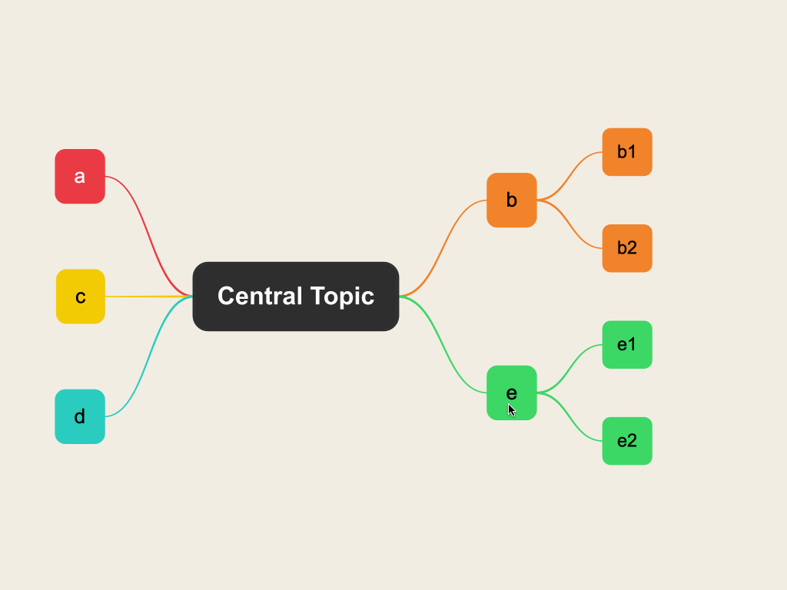
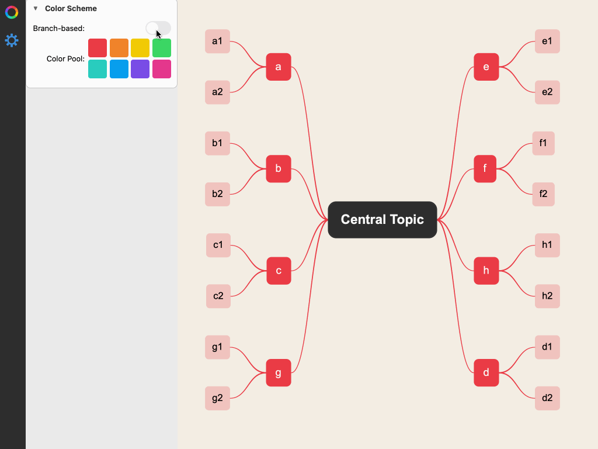
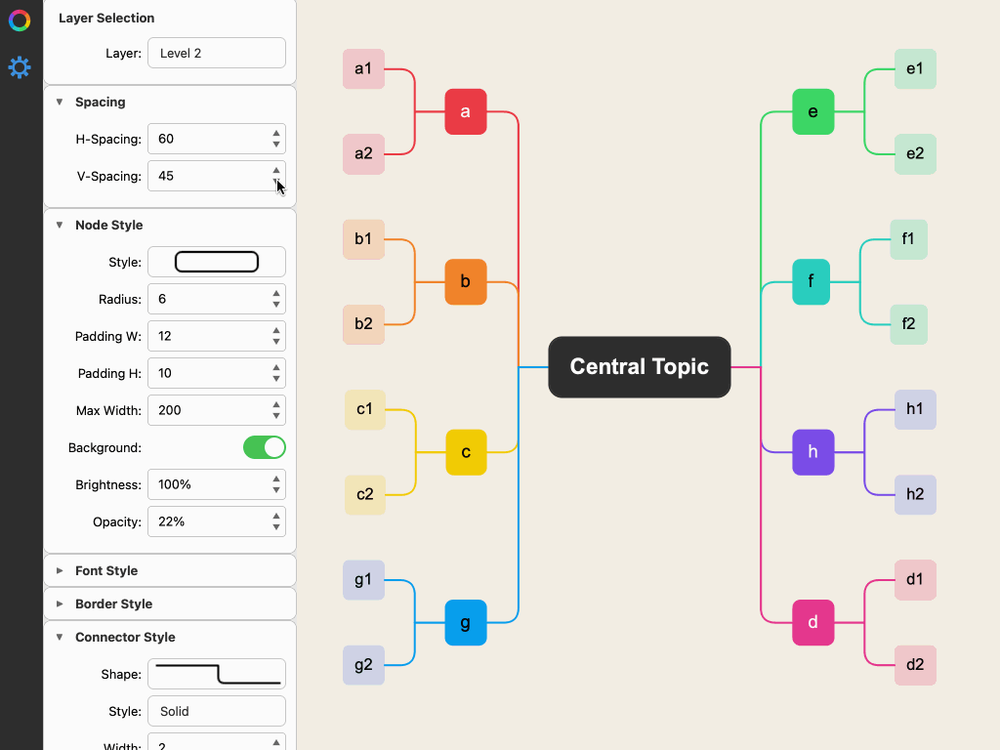

# Cogist

拥有智能布局算法的跨平台思维导图工具，聚焦你的思想！

[](https://opensource.org/licenses/MIT)
[](https://www.python.org/downloads/)
[](https://doc.qt.io/qtforpython-6/)
[](https://github.com/cogist/cogist/releases/tag/v0.5.1)
[](CHANGELOG.md)

## ✨ 核心功能
- 支持主流桌面平台：Windows、macOS、Linux
- 自动布局算法：你只需要聚焦所关心的问题，其他全由Cogist为你搞定！
- 发散性思维：你可以完全进行发散性思考，考虑问题的方方面面，不用担心思路混乱
- 整理思路轻而易举：可以随时通过鼠标拖拽节点树来改变父节点，即使调整思路，易于归纳总结
- 快捷的键盘操作：
  - 支持按Tab键添加子节点，按Space添加兄弟节点，Delete/Backspace删除当前节点，操作快速无比
  - 通过鼠标或键盘方向键在节点间移动，轻松改变当前节点
- 平滑的视图缩放：支持键盘、鼠标、手势等多种方式缩放、平移视图
- 鲜艳的色彩或简捷商务风格：基于颜色池的配色方案设计，支持一键切换彩虹分支模式和精简商务模式
- 强大的样式定制功能：通过样式面板提供间距、形状、背景、边框、线型、粗细、字体、阴影、连线、颜色、亮度、透明度等全方位样式调节能力，全力满足用户各种审美需求
- 样式修改即时生效：无需按确定按钮来更新样式，所有样式修改即时生效，一目了然
- 基于角色/层级的样式管理系统：将层级映射到角色，基于整个角色一次性改变样式，既不至于呆板，也不会过于琐碎
- 全局undo/redo功能支持：所有命令都可以通过undo/redo操作恢复，包括增删节点、改变样式等。你可以随意修改，无需担心操作失误
- 布局、模板和配色方案随意组合：未来将支持一键选择布局算法、模板或配色方案，整体性切换视图风格。
- 基于优先级的节点重要性样式定义：未来将支持基于重要、普通、次要的三级节点重要性定义，可以针对任何节点单独进行设置，相同重要性的节点采用同样的样式突出显示，一眼看清重点所在

## 📸 功能演示

### 拖拽节点演示



*拖拽节点到新的父节点，子节点自动跟随，即时重新布局*

### 彩虹分支模式演示



*一键切换彩虹分支模式，不同分支自动使用不同颜色，思路清晰一目了然*

### 间距调节演示



*实时调节节点间距，所有修改即时生效，所见即所得*

## 📥 下载

| 平台 | 架构 | 下载链接 |
|------|------|----------|
| Windows | x64 | [即将发布](https://github.com/cogist/cogist/releases) |
| macOS | Universal (Intel + Apple Silicon) | [即将发布](https://github.com/cogist/cogist/releases) |
| Linux | x64 | [即将发布](https://github.com/cogist/cogist/releases) |

> 💡 **提示**：也可以从源代码运行（需要 Python 3.13+ 和 uv）
> ```bash
> git clone https://github.com/cogist/cogist.git
> cd cogist
> uv sync
> uv run cogist
> ```

